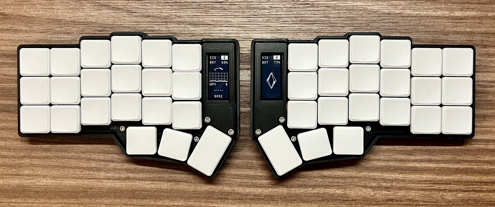

# Corne Wireless Config

This repo allows me to edit, build, and download firmware for my Corne.

## Keyboard Layout

The main base layer is simply a mirror of the MacBook keyboard layout. The actual layout customization is handled at the system level through [kanata](https://github.com/jakmaz/dotfiles/tree/main/kanata).

This approach allows me to use the same keybinds from my Corne and laptop keyboard in a similar way, providing consistency across both devices.

## How do I download the firmware?

Check out the actions tab and look at the "artifacts" for each action run.

## Kit Source

I bought my kit from [Typeractive](https://typeractive.xyz). The whole experience was great and their documentation, guides, and firmware made it super easy to put together.

If you're interested in a corne or lily58 keyboard of your own, check them out!
